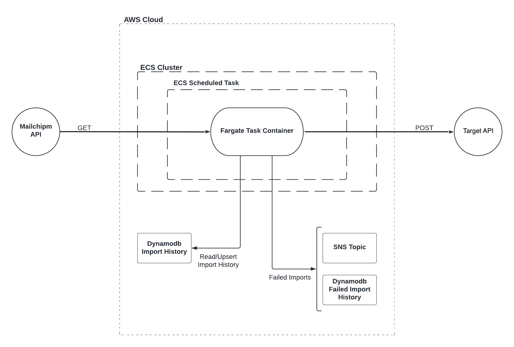
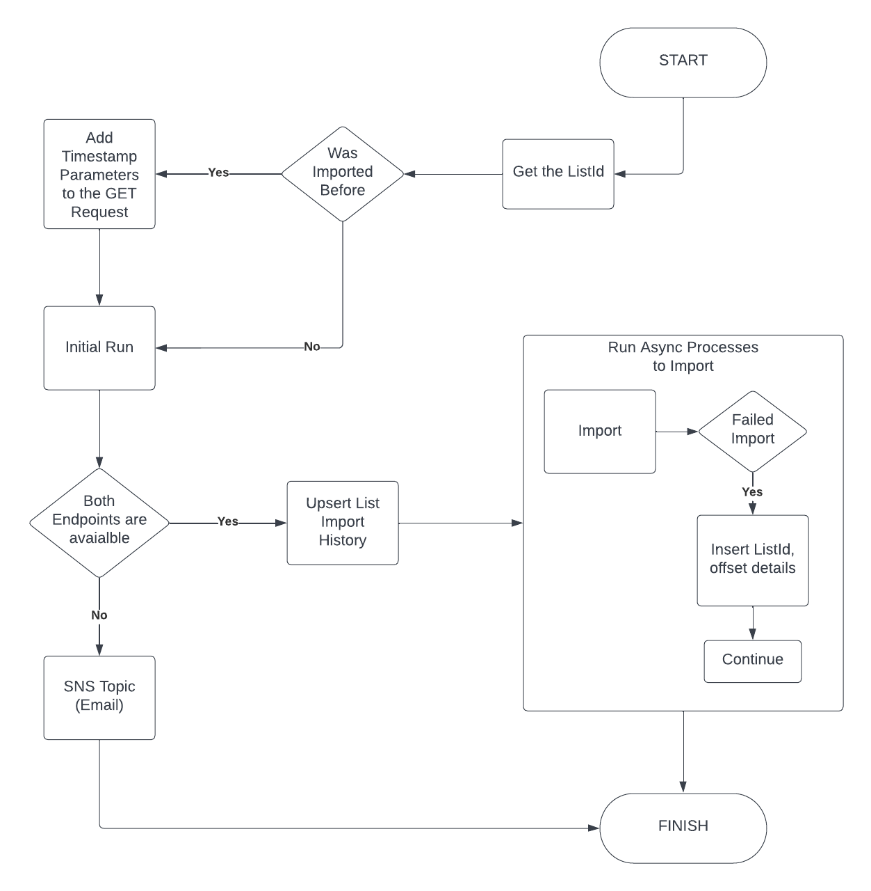
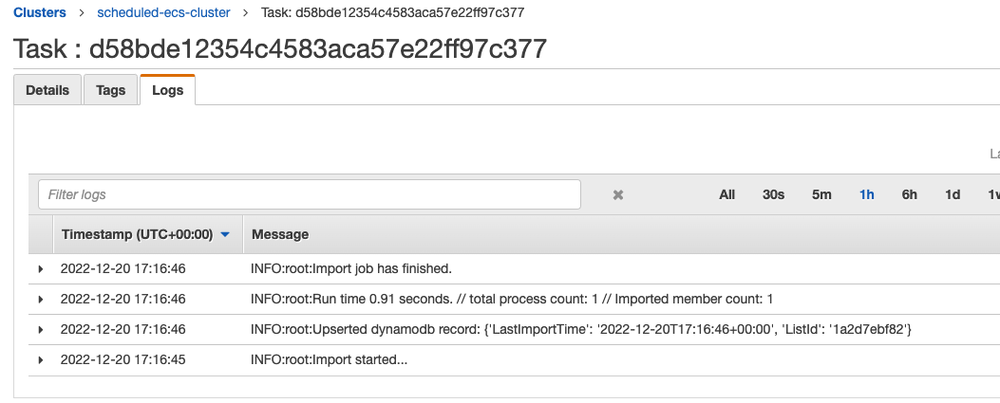
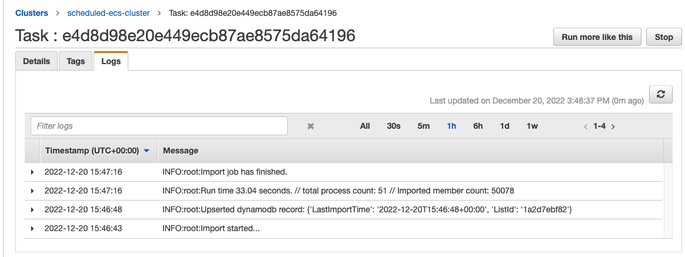
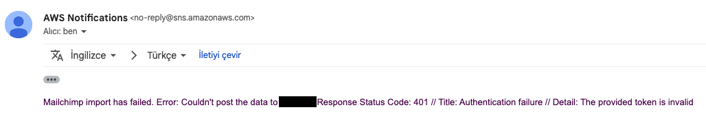
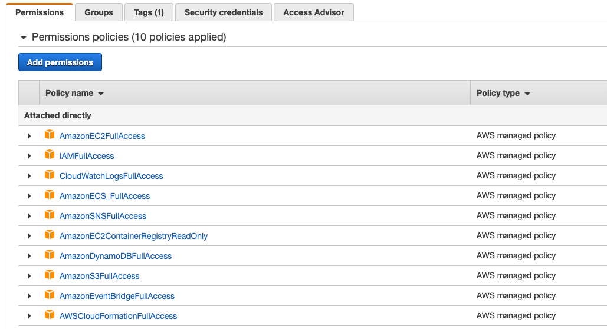

## Scheduled Fargate - Mailchimp List Importer

Authored by;
- Furkan Ayik furkanayik.94@gmail.com

This is a scheduled task project to import Mailchimp list members to taget api regularly. AWS Cloud services are used with dockerized
Python project. Find details below.

In order to deploy the project, please check the section "Deploy"

## Development

In order to schedule a task on AWS Cloud, AWS ECS Service is used with a Fargate task. Python project (src module in the directory) is dockerized
by using AWS ECR. And scheduled task defined to run the Python module once in 90 minutes.

In the **infrastructure** folder, related terraform configurations are created in order to run a scheduled task in the ECS Cluster. This terraform configuration 
also contains definitions of two Dynamodb table used in the project. 

In the Python project, related files created as modules with functionality. 

Mailchimp api limits requests with max count of 1000. This is why multiple async api calls implemented via [asyncio](https://docs.python.org/3/library/asyncio.html) and [aiohttp](https://docs.aiohttp.org/en/stable/).
After import starts, a first **initial run** is implemented. Reason is; checkin if both endpoints are available. If there is any issue there is no point
to run the async processes. If there is an issue with this first step, import terminates and publishes the SNS topic for alerting.

If there is no issue with the initial run, async processes run with offset parameter. This parameter is calculated after the inital run, which gets the
total item count. This is how pagination and offset numbers are calculated to create async processes. 

Mailchimp has a limit with api connections ("The Marketing API has a limit of 10 simultaneous connections") [docs](https://mailchimp.com/developer/marketing/docs/fundamentals/)
this is why async connections are limited by 10 in the project;

`connector = aiohttp.TCPConnector(limit=Params.TCP_CONNECTOR_LIMIT)`

After the initial run, list import history on dynamodb table is updated with timestamp. If history record exists it updates the date. If it doesn't exist
it is being created. At the beginning of import, is being checked to see if this list was imported before. If it was imported, timestamp parameters are added to Mailchimp GET request.
This way, importer wouldn't have to get and import all the list. 

#### Second Run with the same list sample. Notice there was only one api call -to each endpoint- and one member(changed between imports) imported;

### Errors, Exceptions

For both api calls, in case response wasn't success; a recursive function call is implemented to wait a second and retry. If it is still not succesfull,
these functions log the response, publish the sns topic with response details and raise. This exception is being handled in the parent functions.

During the initial run, if one or both endpoints are not available and don't return success status codes, SNS Topic is published to send an email with the response details.
After that, async processes don't run. In the case where async processes face with an issue then offset, listId details and response is inserted to 
related failure history table to handle the import for that process later. This case wouldn't stop the whole execution, other processes continue running. 

Also, all errors and info messages are being logged and can be monitored via AWS.

As mentioned above, there is an SNS Topic created for alerting. This topic sends an email when there is an error.

## Deploy

In order to test it, you will need a mailchimp api key and a test list in their system. Apart from that, you will need a
post endpoint that you can post the import data. When you have both sides, change the api keys and base url's inside the file
data. (Change the related params)

If you cannot provide these API's, you can still deploy the project, but it will give an error that can still be monitored.

### Requirements

- Docker
- AWS Account and CLI (configured with credentials)
- Terraform (with CLI)
- Python3

### Steps

#### Create an ECR Repository on AWS;

- Login to your AWS Console, navigate to Elastic Container Registry (ECR)
- Create a repository called "scheduled-ecs" and copy its URI for further steps

#### Local Steps;

- Run docker
- cd in to the project folder.
- You need to create two parameters with your ECR Repository URI. Param repo will contain your full URI and param uri will be equal to
your URI without the repo name at the end. See samples below and then run below commands in the project directory;

repo: xxxxxxx.dkr.ecr.us-east-1.amazonaws.com/scheduled-ecs
uri: xxxxxxx.dkr.ecr.us-east-1.amazonaws.com

- `echo "xxxxxxx.dkr.ecr.us-east-1.amazonaws.com/scheduled-ecs" > repo`
- `echo "xxxxxxx.dkr.ecr.us-east-1.amazonaws.com" > uri`

- After this step run push.sh to push your image to repository. Script should push the image and you shoudl be able to see on aws console.
  (run.sh will run it with local docker)
- `source push.sh`

- After your image is pushed run below terraform commands to create the infrastructure and scheduled fargate task.
- `cd infrastructure`
- `terraform init`
- `terraform apply` (type yes after plan is created)

Check the ECS Cluester and your scheduled task logs to see the runs.

### Run `terraform destroy` when you are done with the project.

### Note: You may need to check your IAM policies to build your infrastructure with terraform.

Sample user policies within the development IAM Role that builds this project;

